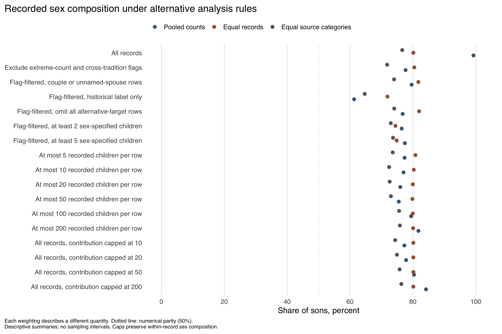
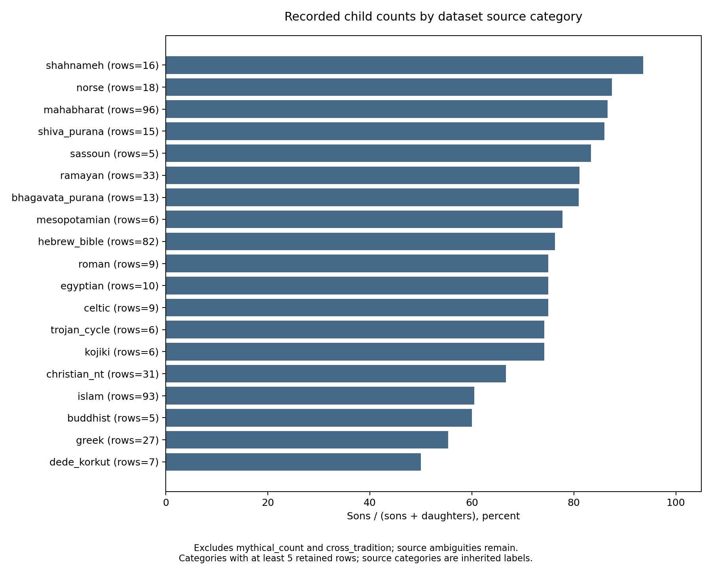

# Epic Children

This project examines how sons and daughters are represented in recorded
genealogies from selected epics, religious texts, and historical accounts.
The question is whether an imbalance persists across sources and counting
choices, or is largely driven by a few enormous families.

The analysis concerns what these records enumerate. Birth patterns, parental
preferences, and selective recording can all affect the counts; this collection
cannot distinguish their contributions.

<!-- BEGIN GENERATED SUMMARY -->

## What we did

We assembled 539 records of families, parents, or groups of children
from selected texts and accounts. Counts include named children, explicit
enumerations, and stated minimum counts. We retained 74 alternative
codings covering source differences, attribution, and counting scope, and
separately coded 23 prayer and birth episodes.

We compare pooled counts with summaries that give equal weight to each record
or source category. We also examine percentiles, limit the contribution of
large records, omit records and source categories in turn, and vary the recorded
source choices. These checks show which features of the collection drive the results.

## What we found

Sons make up a majority under each weighting below, but the size of the imbalance
changes substantially. The uncapped total is especially sensitive to extraordinary
enumerations.

| Summary | Share of sons |
|---|---:|
| Pooled counts, uncapped | 99.2% |
| Equal weight per record | 80.1% |
| Equal weight per source category | 76.6% |
| Total contribution capped at P90 (8 children) | 77.1% |
| Total contribution capped at P95 (13 children) | 77.3% |
| Total contribution capped at P99 (100 children) | 83.0% |

The share is sons / (sons + daughters). The equal-record mean averages these
shares; the equal-category mean averages pooled shares within nonempty `epic`
categories. Records without sex-specified children do not enter either mean.
These summaries describe different quantities.



Each row applies a selection or contribution rule to the baseline coding. Points
compare pooled, equal-record, and equal-category summaries; the dotted line marks
50%. These are descriptive comparisons, without sampling intervals.

### Distribution across records

| Measure | Records | P10 | P25 | Median | P75 | P90 | P95 | P99 |
|---|---:|---:|---:|---:|---:|---:|---:|---:|
| Recorded sons | 526 | 1.00 | 1.00 | 1.00 | 3.00 | 6.00 | 10.00 | 100.00 |
| Recorded daughters | 526 | 0.00 | 0.00 | 0.00 | 1.00 | 2.00 | 3.00 | 11.25 |
| Recorded children, all sexes | 526 | 1.00 | 1.00 | 2.00 | 4.00 | 8.00 | 13.00 | 100.00 |
| Share of sons (%) | 525 | 33.33 | 66.67 | 100.00 | 100.00 | 100.00 | 100.00 | 100.00 |

Percentiles give each record equal weight and use linear interpolation between
ordered observations (R's `quantile(type = 7)`). Count distributions exclude
zero-total records, which can represent inactive accounts. Share distributions
exclude records with no sex-specified children. A median share of 100% describes
the middle record, not the pooled counts.

Winsorization is upper-only: estimate the size cutoff among positive-total records,
then multiply each record's sons, daughters, and unspecified-sex counts by
`min(1, cutoff / total)`. This preserves sex composition and retains records while
limiting their contribution. Cutoffs are recomputed within each selection and
coding version. Counts in the source CSV stay unchanged. Ties mean the fraction
capped need not equal the nominal tail.

### Other sensitivity checks

Removing the most influential record, Sagara and Sumati, gives 86.8%
sons. Excluding the 7 inherited `mythical_count` records
gives 77.5% sons. Also excluding `cross_tradition` records gives
77.6%; restricting further to records labelled historical gives
61.3%. The flags are inherited classifications, not quality
ratings; some other 100-son records are unflagged. The historical subset also
differs in source composition.

Allowing the recorded alternatives to vary jointly gives 74.9–79.2%
for the flag-filtered selection. This is a mechanical sensitivity range, not a
confidence interval or necessarily a coherent textual edition. Full outputs also
cover count thresholds, fixed contribution caps, record and category omissions,
and allocation of unspecified-sex children.

The episode wording codes are 8 son, 0 daughter,
1 both, and 14 unspecified. The list
includes announcements, unintended conception, and revival requests; these counts
do not measure prospective parental preferences.

### Variation across source categories



Bars show sons / (sons + daughters) after excluding `mythical_count` and
`cross_tradition` records. Categories with at least five retained rows are shown;
labels give row counts. These compare selected records under inherited source
labels, not populations or independent samples of traditions.

The collection is selected rather than representative. Records can overlap, and
sources can omit or leave children unnumbered. The checks establish sensitivity
within this collection; they do not separate selective recording from differences
in family composition. No population significance tests or sampling confidence
intervals are reported.

<!-- END GENERATED SUMMARY -->

## Underlying data

[Child records](data/epic_children.csv) ·
[Prayer and birth episodes](data/epic_prayer_for_children.csv) ·
[Additional coding alternatives](data/alternatives.json)

Each child row represents a sourced family, parent, or enumerated group.
It can include biological, adoptive, or household relationships, and is not
necessarily a unique couple or a complete genealogy. Read `source` and
`comments` for the passage, translation, counting scope, and unresolved issues.
Evidence includes primary passages, secondary summaries, and stated inferences.

| Fields | Meaning |
|---|---|
| `parents`, `husband`, `wife` | Parent labels; marriage and biological parenthood are not always established. `unknown`, `multiple`, and `none` are placeholders. |
| `husband_id`, `wife_id`, `family_id` | Inherited parent IDs and selected family links. Coverage and identity resolution are incomplete; these are not universal deduplication keys. |
| `n_sons`, `n_daughters`, `n_unknown_sex` | Recorded counts, including stated minimum counts. Zero can mean no child counted rather than an explicit statement of absence. Unspecified sex does not measure omitted or unquantified children. |
| `sons`, `daughters` | Names or descriptions supporting the counts, not standardized lists. |
| `epic`, `row_type`, `historicity` | Source category, record type, and inherited historical classification. Categories vary in scope and are not independent sampled traditions. |
| `source`, `comments` | References and coding explanations. |
| `alternate_*` | One alternate account per row, with complete counts, descriptions, source, explanation, and `alternate_id`. Rows sharing an ID change together. Blank fields mean no recorded alternative. |

Alternatives replace affected records rather than adding children. Each is
applied separately to the baseline; only the joint sensitivity calculation
combines choices. Differences can concern names, attribution, or counting
scope without changing totals. The recorded alternatives do not exhaust
textual variation.

In the episode data, `desired_gender` codes explicit wishes in the cited
wording. A promise or the child's eventual sex does not establish a wish;
`unspecified` does not mean indifference. The outcome fields associate children
with episodes without establishing that prayer caused a birth.

## Reproduce the analysis

Use R 4.6.0. Package versions are recorded in `renv.lock`.

```sh
make restore
make check
make reproduce
```

`make check` runs lint, tests, and source-data validation. `make reproduce`
regenerates tables, alternative datasets, figures, and the numerical results
in this README. Functions live in [R/](R/); [scripts/run_all.R](scripts/run_all.R)
writes the analysis tables, [scripts/figures.R](scripts/figures.R) draws the
figures, and [scripts/tables.R](scripts/tables.R) updates the results above.
Figures are available as PNG and PDF. `make ci-docker` runs the checks in the
standard `rocker/r-ver:4.6.0` image.

| Results | Contents |
|---|---|
| [Distributions](results/distributions.csv), [winsorization](results/winsorized.csv) | Percentiles, size cutoffs, numbers of capped records, and weighted summaries for every coding version across three selections. |
| [Robustness](results/robustness.csv) | Seventeen selection and weighting rules for every version. |
| [Influence](results/influence.csv), [joint coding ranges](results/coding_envelope.csv) | Omission checks and extreme shares under combined coding choices. |
| [Counts](results/summary.csv), [group summaries](results/group_summary.csv) | Counting policies overall and by source, row type, or historicity. The legacy `sons_cap_200` policy caps sons alone. |
| [Alternative datasets](results/alternatives/), [episode summaries](results/prayer_summary.csv) | Each alternative applied separately, and episode wording codes by source. |

To generate tables elsewhere without changing this README or the figures:

```sh
Rscript scripts/run_all.R --output-dir /tmp/epic-children-results
```

To correct a record, check the exact passage and translation, edit its counts
and source notes, and rerun the checks and analysis. Preserve reasonable
alternative accounts in `alternate_*`; use a shared `alternate_id` for changes
spanning rows. Git tracks corrections. Validation checks structure and internal
consistency, not source completeness or the accuracy of every attribution.

## Citation

Use the metadata in [CITATION.cff](CITATION.cff) to cite the data or analyses.
Include the release or commit used so readers can identify the exact version.
